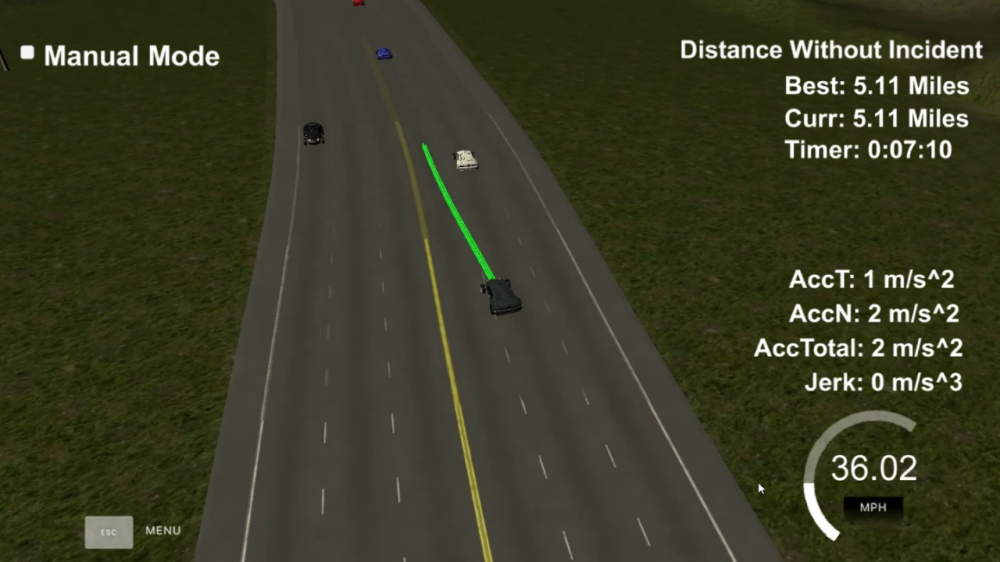

# Path Planning
Create smooth, safe paths for the car to follow along a 3 lane highway with traffic.

---

## 1. Introduction
This document describes path planning model implemented in my code. My model can be logically split into 4 parts:
1. Map segmentation and transformation between Frenet and Cartesian coordinate systems.
2. PID controller for cruise control implementation.
3. Lane change with a minimal jerk.
4. Planning and collision control.

All these parts will be described in more details with reference to the appropriate classes and methods where applicable.

## 2. Map segmentation and transformation between Frenet and Cartesian coordinate systems

### 2.1. Definition of the Frenet coordinate system
The Frenet coordinate system makes path planning problem independent of the complexity of the real landscape. It allows creating an algorithm which will work on the majority of real roads. Unfortunately, the Frenet coordinate system is not inertial and has it own kinematic and dynamic parameters. Some of these parameters could be ignored, some must be included in the vehicle model. It will be discussed together with a PID controller. In this section, I will discuss the problem of the transformation of the road coordinates only.

Let's assume that Frenet coordinate system is tied with central yellow curve line on the road which split vehicles moved in opposite directions. **s** (longitudinal) axis of this coordinate system is tangent to this central line, **d** (lateral) axis is directed at the side of the road where our vehicle moves and pass throw vehicle position on the road at some time **T**. In this coordinate system vehicle **s** coordinate at any moment of time is equal to 0. And it's not very useful. But we can use some modified coordinate system and assume that **s** is a distance which Frenet coordinate system origin point passed when moved from some fixed point on the central road curve till current position. This value invariant of time moment **T** and depends only on vehicle position on the road.

In this coordinate system **d** axis is always a distance of the vehicle from the center of the road. And it must be always positive value if the vehicle moves by the correct side of the road.

### 2.2. The approach of the conversion
Now when we defined the Frenet coordinate system, we can convert between geographic coordinates (Cartesian coordinates) to Frenet coordinate system tied to road line. I will use next image for reference.

To convert Cartesian coordinates to Frenet coordinates I split road map to segments and approximate each segment by 3-rd order spline. Fortunately, we have the road map in the format which makes possible do this segmentation.

The map is set of the road points in the next format:
* **x**, **y** - Cartesian coordinates of the road point.
* **s** - a length of the segment of the central yellow road line between some fixed point (origin point of Frenet coordinates) and current point of the road. This value is exactly Frenet **s** coordinate of this exact point of the road.
* **dx**, **dy** - normal vector to the yellow lane at this exact point. This vector defines the lane curvature and directed to the drivable part of the road. On the image above these are **n0** and **n1** vectors. Note, that this vector must be normalized to a unit vector (with length equal 1).

This information is enough to approximate road central line segment between 2 points by 3-rd order spline. Moreover (and it is very important), that each road segment will be smoothly connected with the next road segment. Otherwise, it causes significant vehicle jerks when we convert our path points back to Cartesian coordinates.

`Y = a3 * X^3 + a2 * X^2 + a1 * X + a0`

This is 3-rd order spline formula with 4 parameters. To calculate these parameters I use 2 coordinates of segment start and end points and 2 normal vectors at the segment start and end. It's enough to smoothly approximate road central line with splines.

But unfortunately, we cannot do this approximation for any segment of the road. The problem in the functional form of the spline equation. To fix this problem let's rotate and shift our road segment until one normal vector starts from the origin of the coordinates and has the same direction as **y** axis. Please see **n0** vector on the image above.

### 2.3. Algorithm
Now we can draw a perpendicular from our vehicle to curve and calculate curve length between it and origin point O. Easy to say... Probably this problem can be solved analytically, but it's too complex. Moreover exists the much more straightforward algorithm to do this (look on the image above):
* Split this curve to small segments
* Pre-calculate length of each segment
* Find perpendiculars **L1** and **L2** to the start and end point of each segment
* Find segment our vehicle belongs to.
* Draw perpendicular **M** to the **L1** which passes exactly throw out vehicle. Find the intersection of this perpendicular with **L1** and **L2** and calculate a length of **a** and **b** segments.
* We can assume that **s(v)** coordinate of the vehicle is curve origin **s** coordinate (directly from the map file) + part of curve segment between **n0** and **L1**
* To calculate **s(v)** more accurate use equation `s' = k * (a + b)` to find **s''(v)** as part of **s'** which proportionally to **a** and **b**: `s''(v) / s' ~ a / (a + b)`. Note, **s'** and **s''** have NO any relation to derivatives.

This algorithm with slight differences works in both sides - from Cartesian to Frenet and vice versa. But one more question remains. It's clear how to find segment when we know vehicle **s(v)** coordinate, but how to do it if we know it Cartesian **(x, y)** position? Algorithm is similar:
* Find road map point nearest to the vehicle, this point belongs to 2 segments
* Select segment where vehicle lays between it start and end vectors (really between lines based on these vectors). To do this, use distance from the point to lane equation.

### 2.4. Radius of curvature
One more useful parameter we can calculate is a radius of the road curvature. To do this use 3-rd order spline formula and equation `R = (1 + (Y')^2)^ 1.5 / |Y''|`, where **Y'** and **Y''** first and second derivatives of the road segment.

### 2.5. Limitations
From the Map Segmentation image, it's clear that in some cases conversion between Cartesian coordinates to Frenet will be ambiguous. And this is true. Fortunately, we can easily estimate conditions when it happens. For this purpose use fact that any perpendicular to circle passes its central point. So, if half of the road width less than the radius of curvature, all perpendiculars will intersect outside of road and conversion between coordinate systems will be uniquely.

In our example, we have the road with 3 lanes on both side 4 meters each. Half of the road width is 12 meters. The radius of curvature of most real roads at least 10 times bigger. So this approach can be safely used on the real roads and in our project.

### 2.6. Code references

**MapSegment** is the main class which implements map segmentation algorithms:
* Class constructor receive coordinates (from file) of segment start and end, rotate and shift it, split to sub-segments and pre-calculate all parameters which will be used for conversion. This class has important parameter **delta** which specify a size of each segment in meters (by axis X). A big value of this parameter causes better conversion performance, but less smooth vehicle behavior, especially on the 3rd (external) lane of the road. Small values decreasing performance.
* **from_global** and **to_global** methods are used to rotate and shift map segment.
* **from_frenet** and **to_frenet** methods are used to convert between Cartesian and Frenet coordinates for this particular segment.
* **SegmentParameters** is container of parameters for **MapSegment**.
* **PathPlanner::to_frenet**, **PathPlanner::from_frenet** - methods are used to find nearest map segment and perform conversion of coordinates.

## 3. PID controller for cruise control implementation
To keep vehicle inside of the road lane and prevent collision with other vehicles I decided use PID controller. Previously I tried to use a quintic polynomial with start and end conditions, but it was not really a practical approach. In this approach, there are several unknown parameters which must be adjusted and it increases the algorithmic complexity of this approach.
PID controller vice versa:
* Uses linear equations and works fast
* It can be implemented without involving any external libraries (like Model Predictive controller which require the external complex solver to be used).
* The same controller can be used to follow any curve trajectory as well as straight line trajectory.

In my code, I combined PID controller with Lane change approach, but in this section, I'll discuss only PID controller.

It's implemented in class **PathPlanner::PIDController**. PID controller controls 2 parameters: longitudinal and lateral acceleration of the vehicle. These parameters are only we can control with help of throttle and steering wheel on the real vehicle.

### 3.1. Parameters of longitudinal PID controller
It's used to keep vehicle speed and distance to ahead vehicle.

* **Kps** - proportional to a difference between current vehicle speed and target vehicle speed (speed limit or speed of the vehicle ahead). Used to speed up the vehicle.
* **Kdsv** - differential negative parameter, proportional to vehicle speed change. Prevents wiggling of vehicle speed across speed limit.
* **Kda** - differential negative parameter, proportional to vehicle normal acceleration. Normal acceleration is one kind of forces which exists in vehicle coordinate system, but not exists in Frenet coordinates which follow vehicle. But centrifugal force is very important kind of forces which push vehicle aside from the road. It's proportional to squared vehicle speed and road radius of curvature: `An = V^2 / R`. PID controller must slowdown vehicle speed when normal acceleration decrease.
* **Kiv** - integral parameter, proportional to integral vehicle speed across fixed time frame.
* **Kid** - integral parameter proportional to a distance between desired vehicle position in some time moment and it actual position. It's used only in case we have ahead vehicle on the same line close enough. If we cannot change line we must follow this vehicle, keep close enough to avoid another vehicle occupy this space, but keep the safe distance as well.
* **Kpts** - proportional to a distance between the desired vehicle position and its actual position. It's used when we close to ahead vehicle than the safe buffer. This parameter force vehicle slowdown.
* **Kdts** - differential negative parameter, proportional to change of distance between the target and desired vehicle position. It's used when we close to ahead vehicle than the safe buffer. Prevents vehicle slow down too fast.

### 3.2. Parameters of lateral PD controller
This is correct, it's PD controller, not PID. It's used to keep the vehicle in the center of the road lane.

* **Kpd** - Cross Track Error (CTE) - proportional to a difference between current vehicle position and lane center.
* **Kdtd** - differential negative parameter, proportional to CTE change, avoid vehicle wiggling across road lane center.

## 4. Lane change with the minimal jerk.
Lane change algorithm is implemented in **PathPlanner::PIDController::process()** method and it's part of **PathPlanner::PIDController** class. This is the most straightforward part of the solution. It's used for lane change or correction of the lane when the vehicle appears far enough from the lane center. In this case, lateral PD or PID controller is not a good choice. But this kind of vehicle movement has well-defined start and end conditions so quintic polynomial (5th order spline) can be used:
* Start conditions - current (or predicted on some step) vehicle lateral position, lateral speed and lateral acceleration. Normally lateral speed and acceleration will be approximately zero, but algorithm not limited to these values.
* End conditions - target lateral position of the vehicle. End lateral speed and acceleration are assumed both zero.
* Time of the movement - it's proportional to vehicle longitudinal speed and I use sinus of **change_lane_angle_deg** parameter (in degrees) to set up this level of proportion. Approximately it's steering degree - bigger value, more rapid lane change.

For solving the quintic polynomial equation I use Householder rank-revealing QR decomposition of a matrix with full pivoting, implemented in **PathPlanner::jerk_minimized_trajectory()** method which depends on Eigen library and **MatrixXd::fullPivHouseholderQr** solver. After that, I pre-calculate and save trajectory lateral points with 20ms intervals and combine it with longitudinal PID controller. The path is refreshed each time simulator requests it, but lateral points are not recalculated if no critical changes in road conditions and vehicle speed, but it is combined with updated longitudinal PID values. Lateral PD controller is switched off in this case.

## 5. Planning and collision control.
Modified PID controller is responsible to generate a safe and smooth path to achieve some externally defined goal. But it doesn't analyze road conditions and doesn't make any decisions. All planning happens in **PathPlanner::generate_path()** method.

Before I describe algorithm I want to explain term of Horizon and Long Horizon are used in my code because it can confuse. Horizon is maximal possible distance vehicle theoretically can reach during planning period of the algorithm without any violations of traffic rules. With 2 seconds planning time and 50 MPH speed limit it will be approximately 44 meters. This distance is assumed reasonable to take in account vehicles ahead or behind. Long Horizon is a bit longer distances used to plan lane change movements. We don't want to take in account vehicles too far ahead. And we cannot take just ahead vehicle speed in the account, because it can differ from average speed conditions of the lane.

* Algorithm receives current position of our vehicle (it already takes into account communication and calculation lags) and pre-processed data from Sensor Fusion Algorithm.
* Algorithm analyzes traffic ahead vehicle on some fixed distance (called as Long Horizon in my code) and calculates the average speed for each line. An empty line is always preferable independently of average speed on other lines.
* Algorithm analyzes positions of the vehicles just ahead and just behind of our car. It will be used in PID controller and lane change decision algorithm.
* In case a vehicle exists ahead of our vehicle and exists empty lane or lane with the higher legal speed limit, the algorithm makes a decision to change lane. The algorithm can plan lane change from any 3 lanes to any other 2. But can do not more that one lane change movement at once by safety reason. To do this algorithm analyze if enough save buffer exists between ahead and behind vehicles to make this movement with current speed and schedule lane change.
* After that modified PID controller is used to plan vehicle path based on target lane and road conditions.
* Created path is checked for collisions in **PathPlanner::check_collision()** method. The collision check is based on predicted positions of our vehicles and other vehicles. In case a collision is predicted, planned vehicle movement is canceled and the system tries to generate another plan which can save vehicle from the accident. It can decide either continue lane change if it's almost finished or changes to the nearest non-busy lane. Sure, PID controller is used to slowing down vehicle to avoid collision with the vehicle ahead. A vehicle behind must keep distance and system takes it into account only when it plans lane change.
* In case lane change is planned and no collision is predicted, but vehicle changed it speed above the critical value, planned lateral points are recalculated to create the more reasonable path.

## 6. Conclusion.
My algorithm combines PID controller, quintic polynomial path planner, collision control and decision making algorithms which keep the vehicle on the road and meet all points of the [project rubrik](https://review.udacity.com/#!/rubrics/1020/view).
